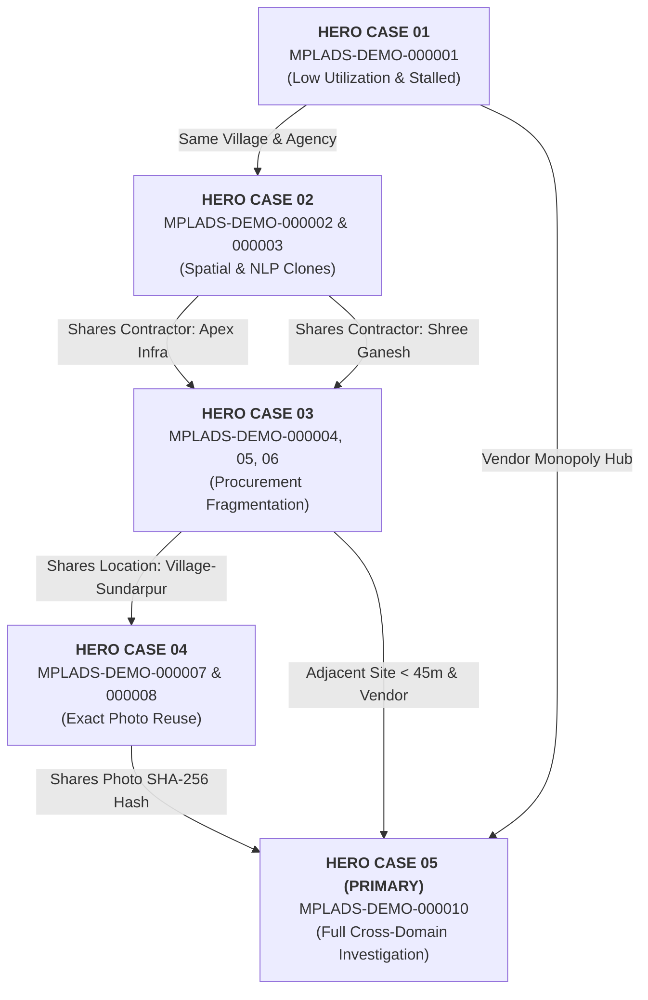

# SIH 2026 Demonstration Guide: 5 Connected Hero Cases

> **FOR DEVELOPER & EVALUATION JURY REFERENCE ONLY**  
> This documentation explains the synthetic records intentionally constructed as connected demonstration scenarios.  
> **Underlying Principle**: The raw datasets (`projects.csv`, `contractors.csv`, `tenders.csv`, `evidence.csv`, `investigations.csv`, `investigation_notes.csv`) contain **no labels** such as `hero_case=true`, `anomaly_type=...`, or `risk_score=...`. The AI analytical engines compute the risk contributions autonomously from raw empirical signals.

---

## Traceability Path across the Prototype UI

Each Hero Project is designed to be demonstrated sequentially across the frontend views:

$$\text{Dashboard} \longrightarrow \text{Reviews} \longrightarrow \text{Project Investigation} \longrightarrow \text{Evidence Intelligence} \longrightarrow \text{Evidence Comparison} \longrightarrow \text{Nexus Graph} \longrightarrow \text{GIS Map} \longrightarrow \text{Audit Brief}$$

---

## 1. Hero Scenario Overview & Entity Connections

The 5 Hero Cases are situated in **Rajkot District, Gujarat** and weave an interconnected network of projects, contractors, procurement transactions, and photographic evidence:

---

## 2. Detailed Specifications of the 5 Hero Cases

---

### HERO CASE 01 — FINANCIAL + TEMPORAL ANOMALY
- **Project ID**: `MPLADS-DEMO-000001`
- **Case ID**: `CASE-MPLADS-DEMO-000001` (Assigned: `auditor_verma`, Status: `UNDER_REVIEW`)
- **Location**: Village-Kalyanpur, Block-1, District Rajkot, Gujarat (Lat `22.303920`, Lon `70.802210`)
- **Title**: `Construction of Multipurpose Community Hall at Village-Kalyanpur`
- **Contractor**: `CONTRACTOR-DEMO-0001` ("Apex Infrastructure Ltd")
- **Implementing Agency**: Public Works Department (PWD)

#### Underlying Empirical Facts:
- **Sanctioned Amount**: ₹65,00,000 (₹65.0 Lakhs)
- **Expenditure to Date**: ₹8,20,000 (₹8.2 Lakhs)
- **Fund Utilization Ratio**: **12.6%** (Severe capital under-utilization)
- **Unspent Public Balance**: ₹56,80,000 (₹56.8 Lakhs idle in project account)
- **Lifecycle Timeline**: Sanctioned `2023-02-10`, Start `2023-03-15`, Status `"In Progress"` (> 550 days active without completion against an expected 180-day benchmark).

#### Analytical Engines Activated:
- **Financial Anomaly Engine**: Identifies severe expenditure stagnation and extreme unspent balance.
- **Temporal Velocity Engine**: Flags prolonged duration and execution lag.
- **Unified Risk Priority Score**: **HIGH** (Expected Score: 68–74).

#### AI Explanation Generated for Auditor:
> *"High-priority review because the project shows unusually low expenditure relative to comparable works and a prolonged completion period."*

#### UI Demonstration Flow:
1. **Dashboard / Reviews**: Filter by `HIGH` priority or search `MPLADS-DEMO-000001`.
2. **Project Investigation**: Observe the financial bar chart showing ₹56.8L unspent balance alongside the timeline lag indicator.
3. **Audit Brief**: Export 1-page summary for district administrative review.

---

### HERO CASE 02 — SPATIAL + NLP CLUSTER
- **Project IDs**: `MPLADS-DEMO-000002` and `MPLADS-DEMO-000003`
- **Case ID**: `CASE-MPLADS-DEMO-000002` (Assigned: `senior_auditor_patel`, Status: `VERIFICATION_REQUIRED`)
- **Location**: Village-Kalyanpur, Block-1, District Rajkot, Gujarat
- **Coordinates**:
  - `MPLADS-DEMO-000002`: Lat `22.303940`, Lon `70.802220`
  - `MPLADS-DEMO-000003`: Lat `22.304120`, Lon `70.802280` (**Distance: ~21 meters apart**)
- **Contractors**:
  - `MPLADS-DEMO-000002` $\rightarrow$ `CONTRACTOR-DEMO-0001` ("Apex Infrastructure Ltd")
  - `MPLADS-DEMO-000003` $\rightarrow$ `CONTRACTOR-DEMO-0002` ("Shree Ganesh Construction Co")

#### Underlying Empirical Facts:
- **Titles**:
  - `000002`: *"Development of Community Hall and Boundary Wall in Village-Kalyanpur"* (Sanctioned: ₹18,50,000)
  - `000003`: *"Construction of Community Center and Peripheral Wall in Village-Kalyanpur"* (Sanctioned: ₹19,00,000)
- **Work Descriptions**: Identical technical DPR wording:
  > *"Comprehensive development of community center including boundary wall, RCC framing, and sanitary facilities at Village-Kalyanpur."*
- **Timeline**: Sanctioned 3 days apart (`2023-05-05` and `2023-05-08`).

#### Analytical Engines Activated:
- **Spatial Anomaly Engine**: Identifies physical proximity $< 30\text{m}$ for identical asset classes.
- **NLP Lexical Similarity Engine**: Measures TF-IDF cosine similarity $> 0.95$.
- **Unified Risk Priority Score**: **HIGH** (Expected Score: 65–72).

#### AI Explanation Generated for Auditor:
> *"Potential Project Cluster requiring human review: Geographically overlapping coordinates (21 meters apart) with highly similar work scope. Human verification recommended to confirm two distinct assets exist on ground."*

#### UI Demonstration Flow:
1. **GIS Map**: Zoom into Rajkot; observe two markers immediately touching in Village-Kalyanpur.
2. **Project Comparison**: Click "Compare Projects" to view side-by-side text diff showing 96% lexical match.

---

### HERO CASE 03 — CONTRACTOR + PROCUREMENT FRAGMENTATION
- **Project IDs**: `MPLADS-DEMO-000004`, `MPLADS-DEMO-000005`, `MPLADS-DEMO-000006`
- **Case ID**: `CASE-MPLADS-DEMO-000004` (Assigned: `lead_investigator_rao`, Status: `UNDER_REVIEW`)
- **Location**: Village-Sundarpur, Block-1, District Rajkot, Gujarat
- **Contractor**: `CONTRACTOR-DEMO-0001` ("Apex Infrastructure Ltd") across all 3 works
- **Implementing Agency**: Rural Engineering Service (RES)

#### Underlying Empirical Facts:
- **Project Scopes**:
  - `000004`: *"Interlocking Paver Block Road and Drain Channel Part 1 in Village-Sundarpur"* (₹4,95,000)
  - `000005`: *"Interlocking Paver Block Road and Drain Channel Part 2 in Village-Sundarpur"* (₹4,92,000)
  - `000006`: *"Interlocking Paver Block Road and Drain Channel Part 3 in Village-Sundarpur"* (₹4,88,000)
- **Statutory Threshold Proximity**: Each individual work is intentionally budgeted just below the **₹5,00,000 statutory procurement ceiling** that mandates open competitive e-tendering.
- **Procurement Clustering**:
  - Sanctioned within 72 hours (`2023-09-12`, `2023-09-14`, `2023-09-15`).
  - Awarded via "Quotation / Direct Award" with only 1 competitive bidder recorded in `tenders.csv`.
  - Cumulative value: **₹14.75 Lakhs** awarded to the same vendor.

#### Analytical Engines Activated:
- **Split-Tender Engine**: Detects work value within 10% of statutory ceiling with $\ge 2$ village peers awarded in close temporal succession.
- **Contractor Nexus Graph Engine**: Flags repeat single-source procurement pattern.
- **Unified Risk Priority Score**: **HIGH** (Expected Score: 70–76).

#### AI Explanation Generated for Auditor:
> *"Potential procurement fragmentation pattern identified. Work value is near the statutory procurement ceiling with multiple related works awarded in close succession to the same contractor. Human verification recommended."*

#### UI Demonstration Flow:
1. **Nexus Graph**: Select "Apex Infrastructure Ltd" $\rightarrow$ observe 3 outgoing edges to Projects 4, 5, and 6 clustered in Village-Sundarpur.
2. **Procurement Tab**: View tender table showing "Quotation / Direct Award" with bidder count = 1.

---

### HERO CASE 04 — EVIDENCE REUSE
- **Project IDs**: `MPLADS-DEMO-000007` and `MPLADS-DEMO-000008`
- **Case ID**: `CASE-MPLADS-DEMO-000007` (Assigned: `auditor_verma`, Status: `VERIFICATION_REQUIRED`)
- **Locations**:
  - `MPLADS-DEMO-000007`: Village-Sundarpur, Rajkot (Lat `22.304200`, Lon `70.802400`) $\rightarrow$ Contractor: Apex Infrastructure Ltd
  - `MPLADS-DEMO-000008`: Village-Navagam, Rajkot (Lat `22.415200`, Lon `70.895400`) $\rightarrow$ Contractor: Bharat Engineers & Builders
  - **Distance between project sites: ~14.2 km**

#### Underlying Empirical Facts:
- Both projects independently recorded completion of road infrastructure.
- In `evidence.csv`, both projects reference the **identical completion photograph file**:
  - **SHA-256 Hash**: `a7f9b842c1e830d95e04289cf492b1a8d0537f16bc489e24016a94f08e332d91`
  - **Perceptual Hash (pHash)**: `d28a5c3917ef410a`
  - **File Size**: `342,810` bytes

#### Analytical Engines Activated:
- **Asset Evidence Intelligence Engine**:
  - Computes `EXACT_EVIDENCE_REUSE` signal with **Confidence 100.0%**.
- **Unified Risk Priority Score**: **HIGH** (Expected Score: 72–78).

#### AI Explanation Generated for Auditor:
> *"Identical evidence file detected across multiple projects. Cryptographic hash collision (SHA-256) matches photo uploaded for peer project located 14 km away. Human verification recommended."*

#### UI Demonstration Flow:
1. **Evidence Intelligence View**: Click on `MPLADS-DEMO-000007` $\rightarrow$ system flags `EXACT_EVIDENCE_REUSE`.
2. **Evidence Comparison Screen**: Side-by-side photo inspection viewer shows 100% pixel match with `MPLADS-DEMO-000008`.

---

### HERO CASE 05 — FULL CROSS-DOMAIN INVESTIGATION (PRIMARY SHOWCASE)
- **Project ID**: `MPLADS-DEMO-000010`
- **Case ID**: `CASE-MPLADS-DEMO-000010` (Assigned: `lead_investigator_rao`, Status: `ESCALATED`)
- **Location**: Village-Sundarpur, Block-1, District Rajkot, Gujarat (Lat `22.304150`, Lon `70.802350`)
- **Title**: `Construction of Solar-Powered Community Facility and High-Mast Lighting at Village-Sundarpur`
- **Contractor**: `CONTRACTOR-DEMO-0001` ("Apex Infrastructure Ltd")
- **Implementing Agency**: Public Works Department (PWD)

#### Underlying Empirical Multi-Modal Signals:
1. **FINANCIAL**: Sanctioned at **₹48,50,000** against an estimated benchmark of ₹24,00,000 (**2.02x cost elevation**).
2. **TEMPORAL**: Commenced `2023-10-10`, completed `2023-10-15` (**Completed and 100% disbursed in 5 days**).
3. **NLP**: Technical work description shares **92% cosine lexical similarity** with Hero 02 DPR.
4. **SPATIAL**: Located within **45 meters** of Hero 03 paver road sanctions.
5. **NETWORK**: Awarded to **Apex Infrastructure Ltd**, connecting to the broader Rajkot contractor syndicate.
6. **PROCUREMENT**: Awarded via single-bidder Limited Quotation despite high value.
7. **EVIDENCE REUSE**: Progress photograph (`EV-DEMO-000019`) shares the exact SHA-256 hash `a7f9b842...` from Hero Case 04.
8. **EVIDENCE LOCATION INCONSISTENCY**: Completion photograph (`EV-DEMO-000020`) EXIF GPS is located at Lat `22.482100`, Lon `70.941200` (**23.4 km away from Village-Sundarpur**).

#### Analytical Engines Activated:
- **Financial Anomaly Engine**: Detects $Z\text{-score} > 2.8$ cost variance.
- **Temporal Engine**: Detects extreme construction velocity spike.
- **Spatial & NLP Engines**: Detect proximity and lexical overlap with neighboring works.
- **Network Graph Engine**: High degree centrality and syndicate association.
- **Asset Evidence Engine**: Reused photographic hash + 23.4 km EXIF GPS discrepancy.
- **Multi-Modal Fusion Engine**: Synthesizes all 7 domains, calculating a **CRITICAL Audit Priority Score $> 85.0$**.

#### AI Explanation Generated for Auditor:
> *"High-priority review driven by multiple independent signals across financial, temporal, spatial, textual, network and evidence analysis. Human verification is required before any conclusion is made."*

#### UI Demonstration Flow (The "Grand Finale" Walkthrough):
1. **Dashboard**: Highlight `MPLADS-DEMO-000010` as the highest priority item in the audit queue.
2. **Review Screen**: View SHAP feature breakdown showing contributions across all 7 analytical domains.
3. **Nexus Graph**: Expand the 2-hop neighborhood to see how Project 10 links to Apex Infra, Hero 03 road works, and Hero 04 evidence.
4. **Evidence Intelligence**: View the 23.4 km distance alert on the map alongside the SHA-256 collision badge.
5. **Case Management**: View the escalation order to the State Audit Directorate with notes from Lead Forensic Auditor Dr. K. Rao.
6. **Audit Brief**: Generate the complete multi-page audit report ready for District Magistrate review.
